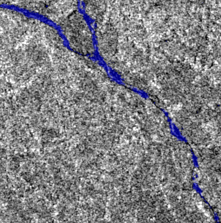

# Satellite-Based Flood Detection Pipeline

<div align="center">

  
  
  
  

</div>


<div align="center">

#### **Using satellite imagery for detecting and mapping floodwater**

  

</div>


## Table of Contents

- [Project Description](#project-description)
- [Features](#features)
- [Project Structure](#project-structure)
- [Methodology](#methodology)
  - [Path A: Rapid Response](#path-a-rapid-response--proof-of-concept)
  - [Path B: High-Accuracy](#path-b-high-accuracy--research-grade)
- [Data Sources](#data-sources)
- [Installation](#installation)
- [Dataset Acquisition Guide](#dataset-acquisition-guide)
- [Usage](#usage)
  - [1. Preprocessing](#1-preprocessing)
  - [2. Training a Model](#2-training-a-model)
  - [3. Running Inference](#3-running-inference)
- [Evaluation](#evaluation)
- [Contributing](#contributing)
- [License](#license)
- [Acknowledgments](#acknowledgments)
- [Contact](#contact)

## Project Description

Floods rank among the most destructive natural disasters, impacting millions globally each year. Rapid and precise flood mapping is vital for effective disaster response and mitigation efforts. This project delivers a scalable, cutting-edge solution for flood detection by harnessing satellite imagery, empowering researchers, data scientists, and emergency responders with advanced tools.

The pipeline utilizes the all-weather reliability of Synthetic Aperture Radar (SAR) data from **Sentinel-1**, with optional integration of high-resolution optical data from **Sentinel-2**. It offers two distinct approaches:

- **Rapid Response:** A lightweight, classical machine learning model (Random Forest) for swift deployment in emergencies.
- **High-Accuracy:** A deep learning model (U-Net) for research-grade precision and operational excellence.

## Features

- **End-to-End Workflow:** Seamlessly handles data acquisition, preprocessing, training, evaluation, and inference.
- **Dual-Sensor Support:** Primarily uses **Sentinel-1 (SAR)**, with optional **Sentinel-2 (Optical)** fusion.
- **Multi-Modal Models:** Combines classical ML (Random Forest) and deep learning (U-Net) for flexibility.
- **Standardized Preprocessing:** Integrates the ESA SNAP Engine for consistent Analysis-Ready Data (ARD).
- **Benchmark Datasets:** Compatible with **Sen1Floods11** and **WorldFloods** for training and validation.
- **Robust Metrics:** Evaluates performance with **IoU** and **F1-Score**, ideal for imbalanced flood data.

## Project Structure

Organized as a Python package for streamlined setup and usage:

```
flood-detection-pipeline/
├── data/                    # Data storage (not tracked by Git)
│   ├── raw/                 # Raw satellite imagery
│   ├── processed/           # Preprocessed, analysis-ready data
│   └── training_data/       # Labeled datasets (e.g., Sen1Floods11)
│
├── notebooks/               # Exploratory Jupyter notebooks
│
├── results/                 # Outputs: models and flood maps
│   ├── models/塑造             # Trained model weights
│   └── maps/                # Generated flood maps (GeoTIFFs)
│
├── src/
│   └── flood_detector/      # Core Python package
│       ├── __init__.py
│       ├── config.py        # Configuration settings
│       ├── data_handler.py  # Data loading and prep
│       ├── evaluate.py      # Evaluation metrics
│       ├── models/          # Model definitions
│       │   ├── random_forest.py
│       │   └── unet.py
│       ├── preprocess.py    # Preprocessing scripts
│       ├── train.py         # Training logic
│       └── predict.py       # Inference scripts
│
├── .gitignore
├── LICENSE
├── README.md
└── pyproject.toml           # Poetry dependency file
```

## Methodology

The pipeline offers two complementary pathways tailored to different needs:

| Feature           | Path A: Rapid Response | Path B: High-Accuracy |
|-------------------|------------------------|-----------------------|
| **Algorithm**     | Random Forest          | U-Net                 |
| **Data**          | Sentinel-1 (pre/post)  | Sentinel-1 + Sentinel-2 |
| **Compute Needs** | Low                    | High (GPU recommended) |
| **Use Case**      | Emergency response     | Research/operations   |

### Path A: Rapid Response / Proof-of-Concept

- **Algorithm:** Random Forest Classifier
- **Data:** Sentinel-1 GRD (pre- and post-flood)
- **Features:** VV/VH backscatter, change detection, DEM derivatives (slope, elevation)
- **Purpose:** Fast deployment with minimal resources for urgent scenarios

### Path B: High-Accuracy / Research-Grade

- **Algorithm:** U-Net (or variants like Attention U-Net)
- **Data:** Fused Sentinel-1 (SAR) and Sentinel-2 (Optical)
- **Features:** Multi-channel tensor with SAR, optical bands, and HAND index
- **Purpose:** Superior accuracy for research and operational systems

## Data Sources

### Two-Phase Data Strategy

- **Training Phase ("Textbook")**
  - **Datasets:** Sen1Floods11, WorldFloods
  - **Goal:** Teach models flood patterns using labeled data

- **Prediction Phase ("Real-World")**
  - **Datasets:** User-downloaded event imagery
  - **Goal:** Apply trained models to new flood events

### Data Requirements

**⚠️ Note:** Input needs vary by model:
- **Random Forest (Path A):** 2 images (pre- and post-flood)
- **U-Net (Path B):** 1 image (post-flood only)

### Sources

- **Primary Imagery:**
  - [Sentinel-1 (SAR)](https://sentinels.copernicus.eu/web/sentinel/missions/sentinel-1)
  - [Sentinel-2 (Optical)](https://sentinels.copernicus.eu/web/sentinel/missions/sentinel-2)
- **Ancillary Data:**
  - [Copernicus DEM](https://registry.opendata.aws/copernicus-dem/)
- **Training Datasets:**
  - [Sen1Floods11](https://github.com/cloudtostreet/Sen1Floods11) (~14GB)
  - [WorldFloods](https://www.worldfloods.org/) (~76GB)

## Installation

1. **Clone the Repository:**
   ```bash
   git clone https://github.com/your-username/flood-detection-pipeline.git
   cd flood-detection-pipeline
   ```

2. **Install ESA SNAP:**
   Download and install [ESA SNAP](http://step.esa.int/main/download/snap-download/) and configure `snappy` per ESA’s instructions.

3. **Install Poetry:**
   ```bash
   pip install poetry
   ```

4. **Install Dependencies:**
   ```bash
   poetry install
   ```

5. **Activate Environment:**
   ```bash
   poetry shell
   ```

## Dataset Acquisition Guide

### Part 1: Benchmark Datasets

#### Sen1Floods11 (SAR)
- **Size:** ~14GB
- **Steps:**
  ```bash
  mkdir data/training_data/Sen1Floods11
  gsutil -m rsync -r gs://sen1floods11 data/training_data/Sen1Floods11/
  ```
  Requires [Google Cloud SDK](https://cloud.google.com/sdk/docs/install).

#### WorldFloods (Optical)
- **Size:** ~76GB
- **Steps:**
  ```bash
  pip install huggingface_hub
  mkdir data/training_data/WorldFloods
  huggingface-cli download isp-uv-es/WorldFloodsv2 --repo-type dataset --local-dir data/training_data/WorldFloods
  ```

### Part 2: Event Imagery (e.g., Limburg Floods, July 2021)

- **Location:** Valkenburg aan de Geul, Netherlands (50.8661°N, 5.8308°E)
- **Source:** [Copernicus Dataspace](https://dataspace.copernicus.eu/)
- **Steps:**
  1. Register and log in.
  2. Search area and filter:
     - **Sentinel-1:** GRD, June 1–July 18, 2021
     - **Sentinel-2:** Level-2A, 0–10% cloud, same period
  3. Download and move to `data/raw/`.

## Usage

Run scripts from the `src/flood_detector/` package.

### 1. Preprocessing
```bash
poetry run python -m src.flood_detector.preprocess \
  --input_path data/raw/S1A_...zip \
  --output_path data/processed/S1A_processed.tif \
  --graph_xml path/to/graph.xml
```

### 2. Training a Model

- **Random Forest:**
  ```bash
  poetry run python -m src.flood_detector.train \
    --model_type random_forest \
    --training_data data/training_data/my_rf_samples.csv \
    --model_output_path results/models/rf_model_v1.joblib
  ```

- **U-Net:**
  ```bash
  poetry run python -m src.flood_detector.train \
    --model_type unet \
    --training_data data/training_data/Sen1Floods11/ \
    --model_output_path results/models/unet_model_v1.h5 \
    --epochs 10 \
    --batch_size 1
  ```
  **Note:** Includes sample inference per epoch, saved to `results/training_logs/`.

### 3. Running Inference
```bash
poetry run python -m src.flood_detector.predict \
  --model_path results/models/unet_model_v1.h5 \
  --input_image data/processed/post_flood_event.tif \
  --output_map results/maps/flood_map_event.tif

poetry run python -m src.flood_detector.predict --model_path results/models/unet_final_test_best.h5 --post_flood_image data/training_data/Sen1Floods11/train/s1_post/Bolivia_76104_S1Hand.tif --output_map results/maps/flood_map_sample.tif
```

## Evaluation

Metrics address flood data imbalance:
- **IoU:** Overlap between predicted and actual flood areas
- **F1-Score:** Balances precision and recall
- **Precision:** Accuracy of flood predictions
- **Recall:** Detection of all flooded areas

## Contributing

Contributions are encouraged! Fork, branch, and submit a pull request.

## License

MIT License. See `LICENSE` for details.

## Acknowledgments

- ESA Copernicus Programme
- NASA/USGS Landsat Program
- Cloud to Street (Sen1Floods11)
